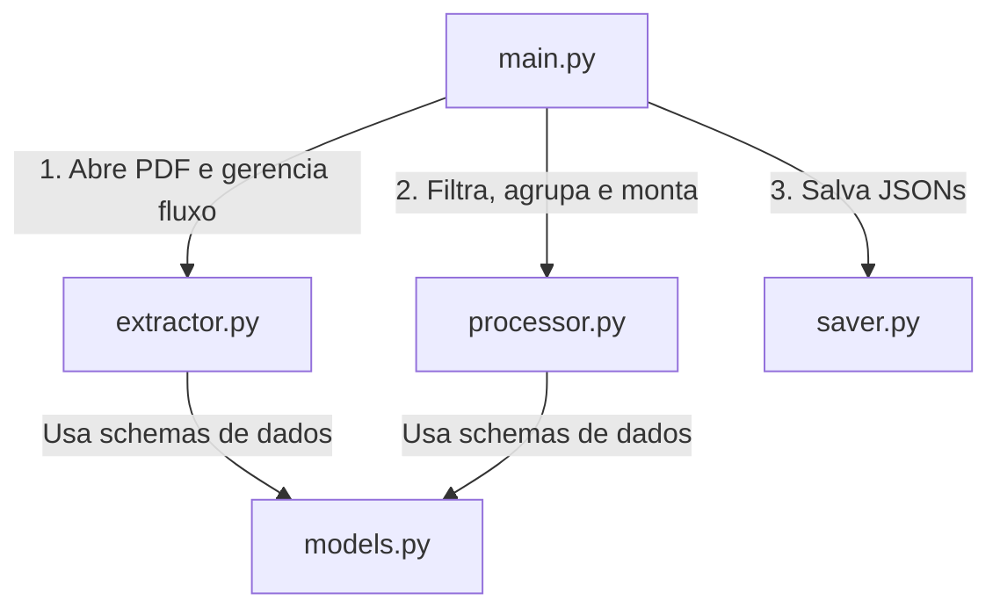

# Guia de Estudos do Extrator de Provas (Unicamp)

Este guia foi elaborado para ajudar você a compreender detalhadamente o funcionamento do código desenvolvido para a extração de provas. Focaremos nas **bibliotecas externas** utilizadas, nos **conceitos de geometria e layout**, e em **recursos avançados do Python base** aplicados no projeto, todos acompanhados de trechos de código práticos.

---

## 📂 1. Arquitetura do Projeto

O código foi dividido de forma modular, seguindo boas práticas de engenharia de software para que cada arquivo tenha uma responsabilidade única:



1. **`models.py`**: Definição das estruturas de dados estruturadas e tipadas via Pydantic.
2. **`extractor.py`**: O motor de interação geométrica com o PDF. Abre o documento, extrai blocos de texto bruto, encontra imagens, renderiza desenhos vetoriais e salva-os.
3. **`processor.py`**: O cérebro lógico. Aplica Regex, separa enunciados de alternativas, detecta edital/ano, aplica o gabarito e realiza o enriquecimento via IA.
4. **`saver.py`**: Grava os dados convertidos de Pydantic em arquivos JSON no disco.
5. **`main.py` / `test_runner.py`**: Os orquestradores sequenciais.

---

## 📦 2. As Bibliotecas Externas com Exemplos de Código

### A. PyMuPDF (importado como `fitz`)
O PDF não é uma sequência de texto simples; ele é uma tela de desenho geométrica com coordenadas detalhadas.

* **Eixo X**: Cresce horizontalmente para a direita.
* **Eixo Y**: Cresce verticalmente para baixo (a origem `(0,0)` é o canto superior esquerdo).

### Exemplo 1: Abrir o PDF e Extrair Blocos de Texto
Para ler os elementos preservando suas localizações geométricas, usamos `get_text("blocks")`:
```python
import fitz

doc = fitz.open("prova.pdf")
pagina = doc[0]  # Primeira página (0-indexed)

# Obtém caixas de texto estruturadas
# Cada bloco é: (x0, y0, x1, y1, "texto do bloco", block_no, block_type)
blocos = pagina.get_text("blocks")
for b in list(blocos)[:3]:
    print(f"Coordenadas: ({b[0]:.1f}, {b[1]:.1f}) -> ({b[2]:.1f}, {b[3]:.1f})")
    print(f"Conteúdo: {b[4].strip()}\n")
```

### Exemplo 2: Renderizar e Cortar Áreas da Página (Desenhos Vetoriais)
Quando encontramos um gráfico ou tabela (desenhados por linhas e curvas vetoriais), capturamos a região e geramos uma imagem de alta resolução com zoom (escala 2x):
```python
# 'm' é um retângulo fitz.Rect contendo as coordenadas do gráfico
m = fitz.Rect(100, 200, 400, 500)

# Define uma matriz de escala (escala 2x para imagem nítida)
matrix = fitz.Matrix(2, 2)

# Gera o pixmap recortando apenas a região do retângulo
pix = pagina.get_pixmap(clip=m, matrix=matrix)
pix.save("imgs/p0_grafico.png")
```

---

### B. Pydantic (BaseModel)
Usamos o **Pydantic** para validar, tipar rigorosamente e exportar nossos dados estruturados diretamente para JSON.

#### Exemplo de Definição de Modelos (`models.py`):
```python
from pydantic import BaseModel
from typing import Optional, List

class AlternativaItem(BaseModel):
    texto: Optional[str] = None
    url_img: List[str] = []
    correta: bool = False

class Conteudo(BaseModel):
    enunciado: str
    url_img: List[str] = []
    resolucao: Optional[str] = None
    dica: Optional[str] = None

class Questao(BaseModel):
    metadados: Metadados
    conteudo: Conteudo
    alternativas: Alternativas
```

#### Exemplo de Exportação Prática:
```python
# Criando a questão
questao = Questao(
    metadados=Metadados(codigo="unicamp_2026_q1", edital="unicamp", numero=1, tipo_ou_cor="Q/X", ano=2026),
    conteudo=Conteudo(enunciado="Qual é o valor de X?"),
    alternativas=Alternativas(
        a=AlternativaItem(texto="Opção A", correta=True),
        b=AlternativaItem(texto="Opção B")
    )
)

# Exportando para dicionário nativo e salvando em JSON
import json
dict_dados = questao.model_dump()
print(json.dumps(dict_dados, indent=2, ensure_ascii=False))
```

---

## 🧠 3. Conceitos Avançados de Python e Expressões Regulares

### A. Divisão de Alternativas Multilinhas (`re.split`)
As alternativas da Unicamp frequentemente possuem várias linhas ou parágrafos. Para separá-las mantendo o separador `a)`, `b)` etc., usamos grupos de captura em `re.split`:

```python
import re

bloco_questao = """Qual é o valor de X?
a) O valor é 10,
pois a soma resulta em dez.
b) O valor é 20,
pois o dobro é vinte."""

# O parêntese ([a-e]) cria um grupo de captura que faz o split reter as letras separadoras!
partes = re.split(r"\n\s*([a-e])\)\s*", bloco_questao)

enunciado = partes[0].strip()
alternativas = {}
for i in range(1, len(partes), 2):
    letra = partes[i]
    texto_alternativa = partes[i+1].strip()
    alternativas[letra] = texto_alternativa

print("Enunciado:", enunciado)
print("Alternativas Extraídas:", alternativas)
```

---

### B. Mapeamento de Gabarito Oficial a Partir de Texto
Conseguimos extrair todas as 72 respostas com a seguinte lógica de Regex no texto extraído do gabarito oficial:

```python
import re

texto_gabarito = """
01 A
02 B
46 C
"""

# Mapeia um número (\d+) seguido de espaço e uma letra de A a E
pares = re.findall(r"(\d+)\s*\n\s*([A-E])\s*(?:\n|$)", texto_gabarito)
respostas = {int(num): letra.lower() for num, letra in pares}

print("Gabarito Mapeado:", respostas)
# Saída: {1: 'a', 2: 'b', 46: 'c'}
```

---

### C. Detecção Dinâmica de Edital e Ano
Desenvolvemos uma lógica inteligente para identificar a prova a partir do nome do arquivo PDF, permitindo isolar as saídas por pastas dinâmicas:

```python
import re
import os

def detectar_edital_ano(pdf_path):
    nome_arquivo = os.path.basename(pdf_path).lower()
    
    # Detecção de edital
    edital = "unicamp"
    if "enem" in nome_arquivo:
        edital = "enem"
    elif "fuvest" in nome_arquivo:
        edital = "fuvest"
        
    # Busca por 4 dígitos de ano
    ano = 2026
    match_ano = re.search(r"\b(20[0-9]{2})\b", nome_arquivo)
    if not match_ano:
        match_ano = re.search(r"\b(20[0-9]{2})\b", pdf_path)
        
    if match_ano:
        ano = int(match_ano.group(1))
        
    return edital, ano

print(detectar_edital_ano("provas/unicamp-2025-primeira-fase.pdf"))
# Saída: ('unicamp', 2025)
```

---

## 🤖 4. Integração com Inteligência Artificial (Google Gemini)

> [!IMPORTANT]
> A IA realiza o enriquecimento automático de campos como `materia`, `tags`, `resolucao` e `dica` de forma estruturada. 
> Usamos o modelo **`gemini-2.5-flash`** que suporta **Structured Outputs** (saídas JSON validadas via Pydantic).

Para otimizar a velocidade, reduzir custos de rede e tokens redundantes, implementamos quatro grandes evoluções arquiteturais na integração com a IA:

1. **Processamento em Lotes (Batching) de 20 questões**: Enviamos até 20 questões em uma única chamada de API. Isso reduz em até 95% o número de requisições de rede e reutiliza o contexto do prompt do sistema de forma extremamente eficiente.
2. **Mapeamento Preciso (`numero`)**: No schema estruturado de resposta em lote (`LoteAnaliseQuestaoIA`), incluímos o campo `numero`. Assim, mesmo recebendo as respostas agrupadas da IA, conseguimos mapear perfeitamente cada resultado para o objeto da questão original em nossa memória Python.
3. **Estimativa de Tempo Dinâmica**: Em vez de chutar um tempo estático, cronometramos a duração exata da **primeira chamada de API (lote 1)**. Usamos essa métrica real somada à pausa de `4.5` segundos obrigatória por requisição (para respeitar o limite de 15 RPM da cota gratuita) para calcular o tempo total estimado restante para todos os lotes subsequentes de forma precisa.
4. **Dupla Defesa (Double-Defense) de Tags**: 
   - *Defesa 1 (Prompt)*: Instruímos severamente a IA no prompt do sistema a retornar apenas tópicos teóricos (ex: "Termodinâmica", "Óptica Geométrica") e proibir a inclusão de nomes de vestibulares ou matérias globais.
   - *Defesa 2 (Filtro programático em Python)*: Passamos os resultados por um filtro de blacklist (`TAG_BLACKLIST`) case-insensitive e busca por substring para higienizar completamente as tags salvas no JSON de saída.
5. **Enunciados Limpos**: O enunciado gravado no JSON da questão permanece 100% fiel à extração original do PDF (sem concatenar textos complementares de apoio fisicamente). Para que a IA analise a questão com contexto completo, passamos o texto complementar de apoio puramente dentro do prompt de forma externa e dinâmica.
6. **Portabilidade de Imagens (Caminhos Relativos), Mapeamento Múltiplo e Nomenclatura Única**: Gravamos as imagens tanto no campo `url_img` (como uma lista de strings `List[str]` para capturar múltiplos elementos como imagens rasterizadas e desenhos vetoriais de uma mesma questão) quanto nas referências markdown dentro do `enunciado` utilizando caminhos relativos `./imgs/{nome_do_arquivo}`. Para evitar qualquer conflito caso imagens de diferentes provas ou anos sejam unidas no mesmo diretório, as imagens são salvas com nomenclatura estruturada baseada no vestibular: `{edital}_{ano}_{tipo_prova}_p{pagina}_img{index}.{ext}` (ex: `unicamp_2026_Q-X_p2_img0.jpeg`). Isso desvincula a estrutura do diretório raiz e permite mover a pasta de saída (ex: `unicamp_2026/`) inteira para qualquer outro computador, servidor web ou aplicação móvel sem quebrar as referências das imagens!

### Código Completo do Módulo de IA Otimizado (Lote de 20):

```python
import time
import os
import google.generativeai as genai
from pydantic import BaseModel
from typing import List, Optional
from models import Questao, LoteAnaliseQuestaoIA, AnaliseQuestaoIA

# A IA recebe e processa em lotes de 20 questões para máxima eficiência!
def enriquecer_questoes_com_ia(questoes, api_key, mapa_textos=None, max_questoes=None):
    """
    Enriquece as questões da prova com resoluções, dicas, matéria e tags geradas por IA.
    Processa as questões em lotes de 20 para otimizar custos e velocidade.
    A estimativa de tempo restante é dinâmica, baseada no tempo real medido da primeira chamada.
    Aplica filtro programático complementar (blacklist) nas tags retornadas.
    """
    if not HAS_GEMINI:
        print("\n[IA Gemini] A biblioteca 'google-generativeai' não está instalada.")
        return questoes

    if not api_key or api_key == "INSIRA_SUA_CHAVE_GEMINI_AQUI":
        print("\n[IA Gemini] Chave de API do Gemini não configurada no arquivo '.env'.")
        return questoes

    questoes_para_processar = questoes[:max_questoes] if max_questoes is not None else questoes
    total = len(questoes_para_processar)
    if total == 0:
        return questoes

    tamanho_lote = 20
    lotes = [questoes_para_processar[x:x+tamanho_lote] for x in range(0, total, tamanho_lote)]
    total_lotes = len(lotes)

    print(f"\nIniciando enriquecimento de {total} questões em {total_lotes} lotes via IA...")
    print("Aviso: Chamadas espaçadas em 4.5 segundos para respeitar o limite de 15 RPM da API.")

    def formatar_tempo(segundos):
        minutos = int(segundos // 60)
        segs = int(segundos % 60)
        return f"{minutos} min {segs} s" if minutos > 0 else f"{segs} s"

    # Defesa 2: Filtro programático complementar contra tags genéricas
    TAG_BLACKLIST = {
        "unicamp", "fuvest", "enem", "vestibular", "prova", "questão", "questao", "questoes", "questões",
        "matemática", "matematica", "física", "fisica", "química", "quimica", "biologia", "história", "historia",
        "geografia", "português", "portugues", "literatura", "inglês", "ingles", "filosofia", "sociologia", 
        "espanhol", "humanas", "exatas", "ciências", "ciencias", "ciências da natureza", "ciências humanas",
        "geral", "materia", "disciplina", "desconhecida", "desconhecido"
    }

    tempo_primeira_req = None

    try:
        genai.configure(api_key=api_key)
        model = genai.GenerativeModel("gemini-2.5-flash")
        mapa_questoes_obj = {q.metadados.numero: q for q in questoes_para_processar}

        for idx, lote in enumerate(lotes):
            if idx > 0:
                time.sleep(4.5)  # Respeita o rate limit da cota gratuita

            print(f"\n[IA Gemini] Processando lote {idx+1} de {total_lotes}...")

            # Defesa 1: Prompt severo de instruções
            prompt = """Você é um professor especialista em vestibulares.
Analise as seguintes questões e forneça de maneira estruturada:
1. Matéria (ex: "História", "Física", "Biologia", etc.)
2. Tags conceituais: Retorne exclusivamente tópicos teóricos ou subtemas do assunto da questão (ex: "Termodinâmica", "Citologia"). É expressamente PROIBIDO incluir o nome do vestibular ("unicamp") ou matérias gerais ("física") nas tags.
3. Resolução detalhada passo a passo em português.
4. Dica de estudo específica relacionada a este assunto.

Abaixo estão listadas as questões a analisar:
"""
            for q in lote:
                prompt += f"\n--- QUESTÃO {q.metadados.numero} ---\n"
                
                # Contexto dinâmico sem alterar fisicamente a gravação dos enunciados em JSON
                if mapa_textos and q.metadados.numero in mapa_textos:
                    texto_comp = mapa_textos[q.metadados.numero].conteudoComp.enunciado
                    prompt += f"[TEXTO COMPLEMENTAR DE APOIO]:\n{texto_comp}\n\n"
                
                prompt += f"ENUNCIADO:\n{q.conteudo.enunciado}\n"
                prompt += "ALTERNATIVAS:\n"
                prompt += f"A) {q.alternativas.a.texto if q.alternativas.a else ''}\n"
                prompt += f"B) {q.alternativas.b.texto if q.alternativas.b else ''}\n"
                prompt += f"C) {q.alternativas.c.texto if q.alternativas.c else ''}\n"
                prompt += f"D) {q.alternativas.d.texto if q.alternativas.d else ''}\n"
                if q.alternativas.e:
                    prompt += f"E) {q.alternativas.e.texto}\n"

            try:
                # Estimativa Dinâmica: Cronometra o tempo real da primeira requisição
                t_start = time.time()
                resposta = model.generate_content(
                    prompt,
                    generation_config=genai.GenerationConfig(
                        response_mime_type="application/json",
                        response_schema=LoteAnaliseQuestaoIA
                    )
                )
                t_end = time.time()
                duracao_chamada = t_end - t_start

                if idx == 0:
                    tempo_primeira_req = duracao_chamada
                    print(f"[IA Gemini] Primeira requisição durou {duracao_chamada:.1f} s.")

                dados_lote = LoteAnaliseQuestaoIA.model_validate_json(resposta.text)

                for analise in dados_lote.questoes:
                    num = analise.numero
                    if num in mapa_questoes_obj:
                        q_obj = mapa_questoes_obj[num]
                        q_obj.especificacao.materia = analise.materia
                        q_obj.conteudo.resolucao = analise.resolucao
                        q_obj.conteudo.dica = analise.dica

                        # Aplica o filtro de dupla defesa contra tags indesejadas
                        tags_filtradas = []
                        for tag in analise.tags:
                            tag_clean = tag.strip().lower()
                            if (tag_clean not in TAG_BLACKLIST and 
                                len(tag_clean) > 1 and 
                                not any(b in tag_clean for b in ["unicamp", "fuvest", "enem", "vestibular"])):
                                tags_filtradas.append(tag.strip())
                        
                        q_obj.especificacao.tags = tags_filtradas

                # Atualiza a contagem dinâmica
                lotes_restantes = total_lotes - (idx + 1)
                tempo_medido = tempo_primeira_req if tempo_primeira_req is not None else 8.0
                tempo_restante = lotes_restantes * (tempo_medido + 4.5)
                tempo_restante_str = formatar_tempo(tempo_restante)
                print(f"Lote {idx+1} de {total_lotes} enriquecido. Tempo restante estimado: {tempo_restante_str}")

            except Exception as inner_e:
                print(f"Erro ao processar lote {idx+1}: {inner_e}")

    except Exception as e:
        print(f"Falha na API: {e}")

    return questoes
```

---

## 🚀 5. Comandos Úteis do Sistema

* **Executar o Extrator com Interface Gráfica Interativa (`main.py`):**
  ```powershell
  & "C:\Users\tocoa\AppData\Local\Python\bin\python.exe" main.py
  ```

* **Executar a Suíte de Validação e Testes Locais (`test_runner.py`):**
  ```powershell
  & "C:\Users\tocoa\AppData\Local\Python\bin\python.exe" test_runner.py
  ```
